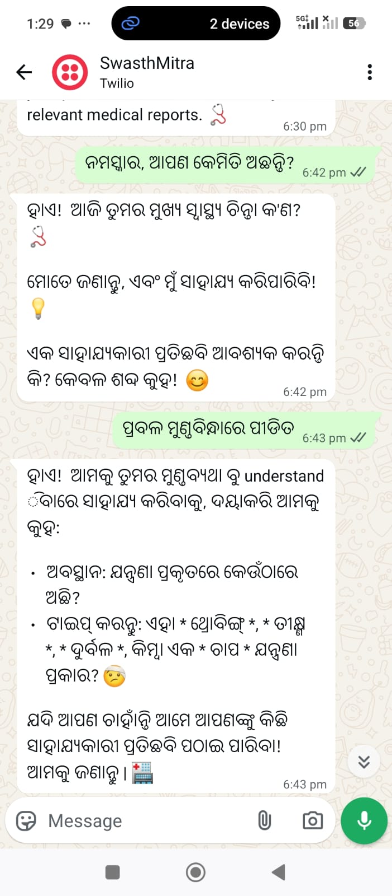
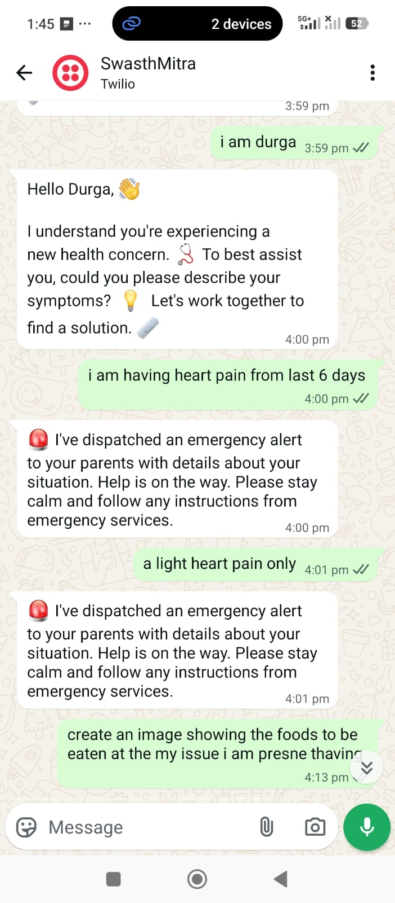
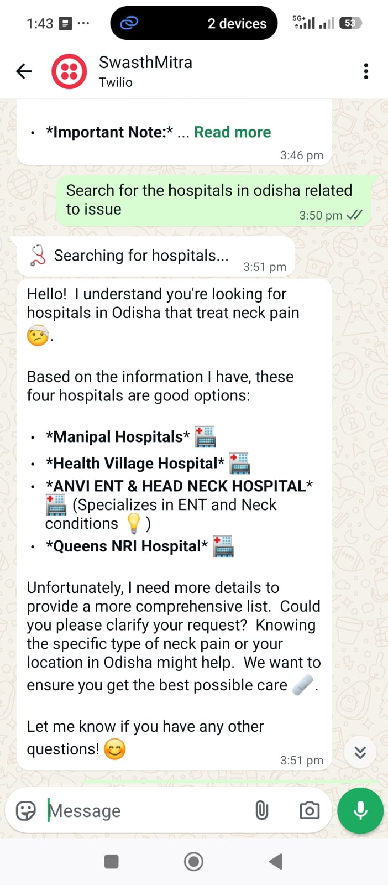
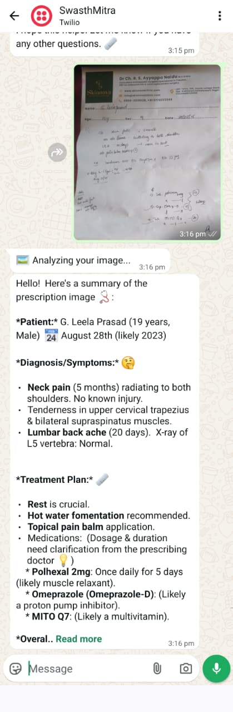
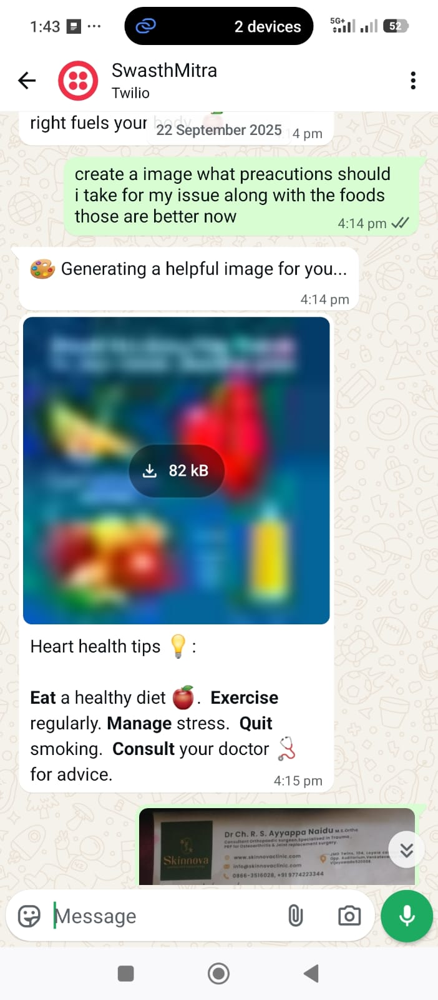
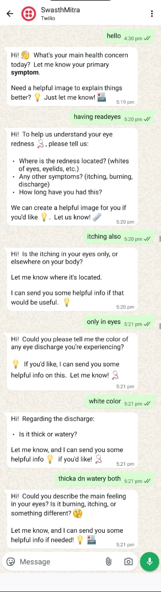

# SwasthMitra-LangGraph

A LangGraph-based healthcare assistant that integrates with WhatsApp to provide medical consultations, emergency alerts, hospital search, and more.

## Architecture Overview

The SwasthMitra-LangGraph project uses a modern, modular architecture based on LangGraph for orchestrating various healthcare tools and services:

```
┌─────────────────────────────────────────────────────────────────┐
│                    SWASTHMITRA LANGGRAPH SYSTEM                  │
├─────────────────────────────────────────────────────────────────┤
│  ┌─────────────────┐  ┌─────────────────┐  ┌─────────────────┐ │
│  │   CENTRAL       │  │   HEALTHCARE    │  │   INTERACTIVE   │ │
│  │   LANGGRAPH     │  │   AGENT         │  │   MENU          │ │
│  │   WORKFLOW      │←─┤   (Intent      │←─┤   SERVICE       │ │
│  │                 │  │   Detection)    │  │                 │ │
│  └─────────────────┘  └─────────────────┘  └─────────────────┘ │
│              │                   │                   │         │
│              ▼                   ▼                   ▼         │
│  ┌─────────────────────────────────────────────────────────────┤
│  │                TOOL INTEGRATION LAYER                       │
│  ├─────────────────────────────────────────────────────────────┤
│  │  ┌─────────────┐  ┌─────────────┐  ┌─────────────┐       │
│  │  │ EMERGENCY   │  │ HOSPITAL    │  │ MEDIA       │       │
│  │  │ CONTACT     │  │ SEARCH      │  │ ANALYSIS    │       │
│  │  │ TOOL        │  │ TOOL        │  │ TOOL        │       │
│  │  └─────────────┘  └─────────────┘  └─────────────┘       │
│  │  ┌─────────────┐                                         │
│  │  │ IMAGE       │                                         │
│  │  │ GENERATION  │                                         │
│  │  │ TOOL        │                                         │
│  │  └─────────────┘                                         │
│  └─────────────────────────────────────────────────────────────┤
│              │                                                 │
│              ▼                                                 │
│  ┌─────────────────────────────────────────────────────────────┤
│  │                SERVICE LAYER                                │
│  ├─────────────────────────────────────────────────────────────┤
│  │  ┌─────────────────┐  ┌─────────────────┐                 │
│  │  │ CHAT HISTORY    │  │ TRANSLATION     │                 │
│  │  │ SERVICE         │  │ SERVICE         │                 │
│  │  └─────────────────┘  └─────────────────┘                 │
│  └─────────────────────────────────────────────────────────────┤
│              │                                                 │
│              ▼                                                 │
│  ┌─────────────────────────────────────────────────────────────┤
│  │                EXTERNAL INTEGRATIONS                        │
│  ├─────────────────────────────────────────────────────────────┤
│  │  ┌─────────────┐  ┌─────────────┐  ┌─────────────┐       │
│  │  │   TWILIO    │  │   GEMINI    │  │   SERPER    │       │
│  │  │   (WhatsApp)│  │   (AI)      │  │   (Search)  │       │
│  │  └─────────────┘  └─────────────┘  └─────────────┘       │
│  └─────────────────────────────────────────────────────────────┤
└─────────────────────────────────────────────────────────────────┘
```

- **Central LangGraph Workflow**: Orchestrates the entire conversation flow and coordinates between all components
- **Healthcare Agent**: Specialized agent that detects user intent and routes to appropriate tools
- **Interactive Menu Service**: Handles dynamic menu generation and user selection processing
- **Tool Layer**: Specialized modules for different functionalities
  - Emergency Contact Tool: Handles emergency alerts with voice calls and SMS
  - Hospital Search Tool: Finds hospitals based on location and symptoms
  - Media Analysis Tool: Processes PDFs, images, and videos for medical insights
  - Image Generation Tool: Creates health-related images based on prompts
- **Service Layer**: Backend services for common functionality
  - Chat History Service: Manages persistent conversation history
  - Translation Service: Handles multi-language support (English/Odia)
- **External Integrations**: Third-party services for core functionality

## Features

- WhatsApp-based healthcare assistance
- Emergency alert system with voice calls and SMS
- Hospital and clinic search functionality
- Medical document/image/video analysis
- Health-related image generation
- Multi-language support (English/Odia)
- Context-aware conversation management

## Demo and Screenshots

<div align="center">

### 🎥 Live Demonstration

[](https://youtu.be/nOwVKOeaa4w?si=bhWKeRQlPhUvam-N)

*Click the image above to watch the full demonstration*

### System Capabilities

| Feature | Description | Screenshot |
|---------|-------------|------------|
| **Multi-Language Support** | Seamless communication in English and Odia languages |  |
| **Emergency Response** | Automatic emergency alerts with voice calls and SMS notifications |  |
| **Hospital Search** | Smart hospital and clinic search based on location and symptoms |  |
| **Medical Report Analysis** | Advanced analysis of medical documents, images, and reports |  |
| **Health Diet Generation** | Personalized diet recommendations and visual guides |  |
| **Intelligent Follow-up** | Context-aware questioning for better diagnosis accuracy |  |

</div>

## Installation

1. Clone the repository:
```bash
git clone <repository-url>
cd SwasthMitra-LangGraph
```

2. Install dependencies:
```bash
pip install -r requirements.txt
```

3. Set up environment variables:
```bash
cp .env.example .env
# Edit .env with your actual API keys
```

## Configuration

The application uses environment variables for configuration. Copy `.env.example` to `.env` and fill in your API keys:

- `TWILIO_ACCOUNT_SID` - Your Twilio Account SID
- `TWILIO_AUTH_TOKEN` - Your Twilio Auth Token
- `GEMINI_API_KEY` - Google Gemini API Key
- `SERPER_API_KEY` - Serper API Key for web search
- `CLIPDROP_API_KEY` - ClipDrop API Key for image generation

## Running the Application

```bash
python main.py
```

The application will start on the configured host and port (default: `0.0.0.0:5000`).

## Project Structure

```
SwasthMitra-LangGraph/
├── agents/                          # LangGraph agents
│   ├── __init__.py
│   └── healthcare_agent.py         # Specialized healthcare agent with intent detection
├── tools/                           # Specialized tools
│   ├── __init__.py
│   ├── emergency_contact/           # Emergency contact functionality
│   │   ├── __init__.py
│   │   └── emergency_tool.py
│   ├── hospital_search/             # Hospital search functionality
│   │   ├── __init__.py
│   │   └── hospital_search_tool.py
│   ├── media_analysis/              # Media analysis functionality
│   │   ├── __init__.py
│   │   └── media_analysis_tool.py
│   └── image_generation/            # Image generation functionality
│       ├── __init__.py
│       └── image_generation_tool.py
├── utils/                           # Utility functions
│   ├── __init__.py
│   ├── medical_advisor.py           # Medical advice utilities
│   └── conversation_manager.py      # Conversation utilities
├── config/                          # Configuration
│   ├── __init__.py
│   └── settings.py                  # Application settings
├── services/                        # Service layer
│   ├── __init__.py
│   ├── chat_history_service.py      # Persistent chat history management
│   └── interactive_menu_service.py  # Dynamic menu generation and processing
├── data/                            # Data storage
│   ├── __init__.py
│   └── chat_histories.json          # Conversation history storage
├── api/                             # API handlers
│   ├── __init__.py
│   └── whatsapp_webhook.py          # WhatsApp webhook handler
├── graph.py                         # Main LangGraph workflow
├── main.py                          # Application entry point
├── requirements.txt                 # Dependencies
├── .env.example                     # Environment variables template
└── README.md                        # Documentation
```

## Usage

1. Connect your WhatsApp Business account to the webhook endpoint
2. Send messages to interact with the healthcare assistant
3. The system will route requests to appropriate tools based on content analysis
4. Emergency messages will automatically trigger alerts to designated contacts

## Contributing

1. Fork the repository
2. Create a feature branch
3. Make your changes
4. Submit a pull request